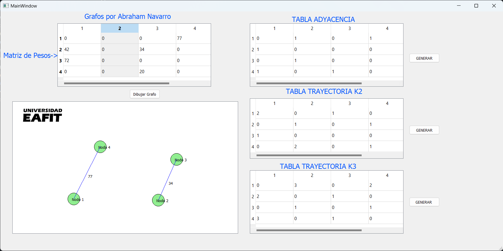

## Nombre de integrantes:
- **Abraham Navarro**

## IDE e Interprete:
- **Python 3.11.9**
- **Visual Studio Code**

-El proyecto consiste en calcular las k-trayectorias en un grafo y mostrarla matriz el grafo en una interfaz grafica

